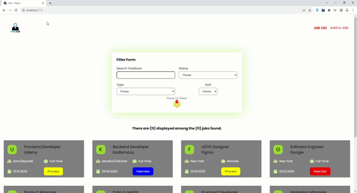

# Job Application Tracker

Job Application Tracker is a web application built using React, Redux, and Axios. It helps you manage and track your job applications easily.

## Screen

## Table of Contents

- [Features](#features)
- [Usage](#usage)
- [Technologies Used](#technologies-used)
- [Project Structure](#project-structure)
- [Contributing](#contributing)
- [License](#license)

## Features

- **Job List**: View a list of your job applications, including details such as position, company, location, status, type, and application date.
- **Add Job**: Add new job applications with ease using a user-friendly form. The form includes fields for position, company, location, status, and type.
- **Filter and Search**: Filter and search for job applications by status, type, and text search to quickly find the applications you're interested in.
- **Sort**: Sort job applications by company name, date (newest or oldest), and more.
- **Responsive Design**: The application is responsive and works on various screen sizes.

## Technologies Used

- React
- Redux
- Axios
- JSON Server (for mock API)
- React Icons
- React Router
- React Toastify
- SASS
- UUID

## Project Structure

The project follows a structured organization with components, Redux, and styles separated. Key components include:

AddJob: Component for adding new job applications.
JobList: Component for listing and displaying job applications.
Card: Component to display individual job cards.
Filter: Component for filtering and searching job applications.
jobSlice: Redux slice for managing job data and filters.
App: Main application component with routing.